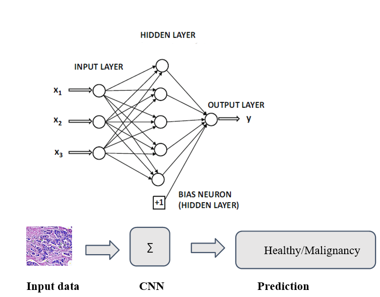

# Cancer-Detection-Using-biopsy-Images-by-Deep-Nueral-Network
Breast cancer starts when cells in the breast begin to grow out of control. These cells usually form a tumor that can often be seen on an x-ray or felt as a lump. The tumor is malignant (cancer) if the cells can grow into (invade) surrounding tissues or spread (metastasize) to distant areas of the body. The challenge of this project was to build an algorithm by using a neural network to automatically identify whether a patient is suffering from breast cancer by looking at biopsy images. The algorithm must be accurate because the lives of people are at stake
# Importance
During a standard mammographic screening examination, an X-Ray image of the patient is captured from the 2 angles of each breast. These images are then inspected by specialists’ physicians for malignancy. Research indicates that most experienced physicians can diagnose cancer with at most only 79 percent accuracy and this data comes from most experienced physician who won’t be readily available at all local hospital, sometimes hard to find in states or maybe in-country and if that happens then with non-experienced physician this number may go far below 79 percent. This may lead to misinterpretation and might be to cause of death. Also, a human inspection of the mammographic report is length, tiring, costly and most importantly prone to error

  

# Loss-Function
In our problem, the probability between 0 and 1 or benign and malignant is given by the loss function Binary Cross-entropy, because each of the values (0,1) belong to one of two complementary classes while making sure the dataset is i.i.d (independent, identical, and distributed). Furthermore, as classification function is given by C = {0 1} where we want to predict only

 

because the probability for the negative class can be derived from it i.e.

  

# Setup
	Hidden layer: Rectified Linear Unit (ReLU)	
	Output Layer: Sigmoid	
	Loss function: Binary Cross-Entropy
	Optimizer: Keras's ADAM
	Learning Rate: 0.0001 (Experimen with various lr)
	sklearn.model_selection: train_test_split
	Split Dataset: 80-20
	Epochs: 100
	BatchSize: 32
	Images in Dataset: 10,000 
	Size: 50x50
# Steps
1. We initialize all filters and parameters or weights with random variable
2. The network takes a training images as input, goes through the forward propgation steps (convolution, ReLU, Pooling, and fianlly forward propgation in the fully connected layer) and find out output probability of each class
3. Use bincay cross entropy loss function to calcualted the total error as below:

  

4. Use Backpropogation to calculate the gradients of the error with respect to all weights in the network and use stochastic gradient descent to update all filter values/weights and parameter value to minimize the output error
5. Repeat steps 2-4 with all images in the training set
